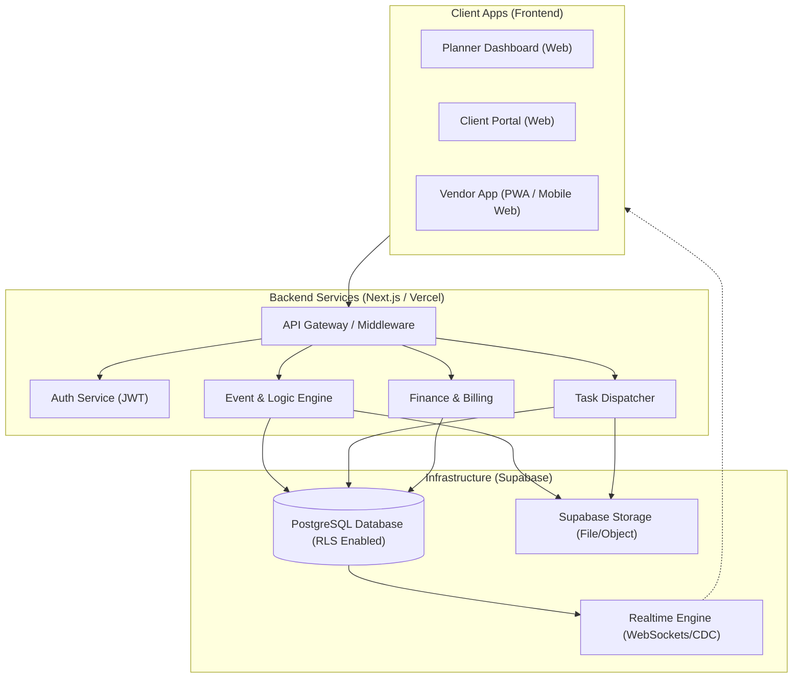
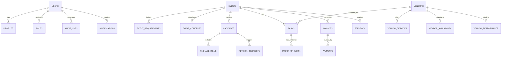

# System Design Document (SDD) - PlannerOS

## 1. High-Level Design (HLD)

### 1.1 Formal Architecture Diagram


### 1.2 Component Breakdown
- **Client Apps**: Three distinct interfaces (Planner, Client, Vendor) optimized for different devices (Desktop vs Mobile).
- **Backend Services**: Serverless Next.js API routes handling business logic and orchestration.
- **Database**: Managed PostgreSQL with Supabase, utilizing Row Level Security (RLS) for data isolation.
- **File Storage**: Supabase Storage for vision boards and proof-of-work uploads.
- **Real-time Engine**: Supabase Realtime (WebSockets) for the "Pizza Tracker" live event status updates.

## 2. Low-Level Design (LLD) - Database Schema

### 2.1 Entity-Relationship Diagram (ERD) - Full SaaS Model


### 2.2 Relational Schema Details (Verified 22 Entities)
Based on the strictly verified Entity list.

#### Group 1: User & Access
- **users** (`id`, `email`, `password_hash`, `role`)
- **roles** (`id`, `name`, `permissions_json`)
- **user_profiles** (`id`, `user_id`, `phone`, `address`, `company_name`, `image_url`)

#### Group 2: Event Management
- **events** (`id`, `planner_id`, `client_id`, `venue_id`, `type`, `date`, `guest_count`, `budget`, `status`)
- **event_requirements** (`id`, `event_id`, `type`, `description`, `priority`)
- **event_concepts** (`id`, `event_id`, `theme`, `vision_desc`, `moodboard_url`)

#### Group 3: Planning & Packages
- **packages** (`id`, `event_id`, `type`, `total_cost`, `status`)
- **package_items** (`id`, `package_id`, `service_id`, `vendor_id`, `cost`)
- **revision_requests** (`id`, `event_id`, `client_id`, `request_text`, `status`)

#### Group 4: Vendor & Services
- **vendors** (`id`, `user_id`, `company_name`, `quality_score`, `payout_details`)
- **services** (`id`, `name`, `category`, `base_price`)
- **vendor_services** (`id`, `vendor_id`, `service_id`, `price`)
- **vendor_availability** (`id`, `vendor_id`, `date`, `status`)

#### Group 5: Execution
- **event_tasks** (`id`, `event_id`, `vendor_id`, `service_id`, `start_time`, `end_time`, `status`)
- **proof_of_work** (`id`, `task_id`, `file_url`, `uploaded_at`)

#### Group 6: Finance
- **invoices** (`id`, `event_id`, `amount`, `type`, `status`)
- **payments** (`id`, `invoice_id`, `method`, `status`, `transaction_ref`)
- **vendor_payouts** (`id`, `vendor_id`, `event_id`, `amount`, `status`)

#### Group 7: Feedback & System
- **feedback** (`id`, `event_id`, `user_id`, `rating`, `comments`)
- **vendor_performance** (`id`, `vendor_id`, `event_id`, `on_time`, `score`)
- **notifications** (`id`, `user_id`, `message`, `status`, `sent_at`)
- **audit_logs** (`id`, `user_id`, `action`, `timestamp`)

## 3. API & Component Design

### 3.1 API Architecture Strategy

- **REST Interface**: 
  - Primary communication via standard RESTful Server Actions and API Routes.
  - JSON for data exchange.
  - Stateless architecture for scalability.
  
- **REST + WebSockets (Hybrid)**:
  - **REST** for CRUD operations (Create Event, Approve Package, Upload Proof).
  - **WebSockets (Supabase Realtime)** for push-based updates. This avoids polling and provides the "Live Tracking" experience (Phase 4).
  - WebSockets will specifically be used for: `Task Status Changes`, `Direct Notifications`, and `Mission Control Dashboards`.

#### API Versioning Strategy
- **Internal (Server Actions)**: Versioning is implicit via file structure.
- **External (REST Routes)**: `/api/v1/{resource}` format.
  - Major versions (v1, v2) for breaking changes.
  - Non-breaking changes added as optional fields.
  - Backward compatibility maintained for at least one major version.

### 3.2 API Interface Design (Server Actions)
Since we are using Next.js App Router, we will use **Server Actions** for mutations and **Supabase Client** for data fetching.

#### Auth Module
- `login(formData)`
- `signup(formData, role)`

#### Event Module
- `createEvent(data)` -> Returns Event ID
- `updateEventStatus(eventId, status)`
- `saveVisionBoard(eventId, moodBoardUrl)`

#### Planning Module
- `checkFeasibility(eventId, date)` -> Returns Conflicts[]
- `generatePackage(eventId, tier)` -> Returns Package Object
- `submitPackageForReview(packageId)`

#### Vendor Module
- `updateAvailability(date, status)`
- `acceptTask(taskId)`
- `rejectTask(taskId, reason)`
- `uploadProof(taskId, formData)`

#### Logic Engine (The Brain)
- **Availability Check**: Query `vendor_availability` and `event_tasks` to find overlap.
- **Budget Calculator**: Sum `package_items` price vs `event.budget_total`.

### 3.3 API Contract Specifications

**Global Standards**
- **Content-Type**: `application/json`
- **Authorization**: `Bearer <supabase_jwt_token>`
- **Response Format**: `{ "data": <payload>, "error": <null|object> }`

#### Module 1: User & Auth
- **POST /auth/signup**
  - **Req**: `{ "email": "user@example.com", "password": "***", "role": "planner" }`
  - **Res**: `{ "user": { "id": "uuid", "role": "planner" }, "session": "jwt..." }`

#### Module 2: Event Management
- **POST /api/events**
  - **Req**: `{ "type": "Wedding", "date": "2024-12-25", "budget": 50000, "guest_count": 100 }`
  - **Logic**: Validates date is future; Creates default "Vision Board" container.
  - **Res**: `{ "event_id": "uuid", "status": "draft" }`

#### Module 3: Planning ("The Brain")
- **POST /api/planning/feasibility**
  - **Req**: `{ "event_id": "uuid", "proposed_date": "2024-12-25" }`
  - **Res**: 
    ```json
    {
      "is_feasible": false,
      "conflicts": [{ "vendor_id": "v1", "reason": "Booked" }],
      "budget_health": "good"
    }
    ```

#### Module 4: Vendor & Task
- **POST /api/tasks/{task_id}/accept**
  - **Header**: `Authorization: Bearer <vendor_token>`
  - **Logic**: Verifies task belongs to vendor; Transitions state `pending` -> `accepted`.

#### Module 6: Live Tracking
- **WS Channel**: `realtime:event:{event_id}`
- **Event**: `task_update`
- **Payload**: `{ "task_id": "t1", "status": "completed", "proof_url": "..." }`

## 4. Module-wise Logic Design

### 4.1 User Module
- **Registration**: Auto-creates `user_profile` entry upon signup trigger.
- **RBAC**: Middleware checks `user_metadata.role` before allowing `/planner/*` or `/vendor/*` routes.

### 4.2 Event Module
- **Creation**: Initializes `events` table entry.
- **Vision Board**: Generates a bucket folder `events/{id}/vision_board`.

### 4.3 Planning Module (The Logic Engine)
1.  **Feasibility Algorithm**:
    -   Fetch all `event_tasks` for `proposed_date`.
    -   Fetch `vendor_availability` for shortlisted vendors.
    -   IF overlap found -> Return `Conflict`.
2.  **Budget Allocator**:
    -   Input: `Total Budget`.
    -   Logic: Apply ratios (e.g., Venue 40%, Catering 30%).
    -   Output: Suggested budget per category.

### 4.4 Vendor & Task Module
- **Auto-Dispatch**:
    -   Trigger: Event Status -> `Planned`.
    -   Action: Create `event_tasks` for each `package_item`.
    -   Notification: Send Push Notification to assigned Vendor.
-   **Emergency Reassignment**:
    -   Trigger: Vendor rejects task.
    -   Logic: Find next available vendor in same `service_category` within budget.

## 5. State Machines & Workflow Logic

### 5.1 Event Lifecycle
- **DRAFT**: Initial creation. Editable requirements.
- **PLANNED**: Package approved. Deposits paid. Tasks generated.
- **LIVE**: Event date = Today. Real-time dashboard active.
- **COMPLETED**: All tasks done. Final invoice generated.
- **ARCHIVED**: 30 days post-event. Read-only.

### 5.2 Task States
- **PENDING**: Assigned but not acknowledged.
- **ACCEPTED**: Vendor confirmed.
- **REJECTED**: Vendor declined (Trigger reassignment).
- **IN_PROGRESS**: Vendor checked in.
- **COMPLETED**: Proof of work uploaded.
- **VERIFIED**: Planner approved proof.

### 5.3 Vendor Job States
- **AVAILABLE**: Open for bookings.
- **BUSY**: Has conflicting task for time slot.
- **OFF_DUTY**: Manually set by vendor.
