# Workflow & Request Flow - PlannerOS

## 1. System Workflow (End-to-End)

### Phase 0: System Setup

### Phase 1: Client Consultation

### Phase 2: Planning & Feasibility (Iterative)

```mermaid
sequenceDiagram
    participant Planner as Planner
    participant System as PlannerOS (Brain)
    participant Client as Client
    
    Planner->>System: Request Feasibility Check
    System->>System: Check Vendor Availability
    System->>System: Check Venue Availability
    System->>System: Validate Budget
    System-->>Planner: Feasibility Report
    
    Planner->>System: Finalize Concept & Research
    Planner->>System: Allocate Budget
    Planner->>System: Shortlist Vendors
    Planner->>System: Plan Logistics
    
    Planner->>System: Generate Packages (Good/Better/Best)
    System-->>Client: Present Packages
    
    alt Client Requests Changes
        Client->>Planner: Request Revision
        Planner->>System: Update Package
        System-->>Client: Present Updated Package
    end
    
    Client->>System: Approve Package
    System->>System: Lock Event
    System->>System: Convert Soft Holds → Hard Bookings
```

### Phase 3: Automated Dispatch

### Phase 4: Live Execution

### Phase 5: Closure & Evaluation

## 2. Request Flow (API Layer)

### Example 1: Client Approves Package

### Example 2: Vendor Uploads Proof of Work

### Example 3: Planner Checks Feasibility

## 3. State Transitions

### Event State Machine

### Task State Machine

